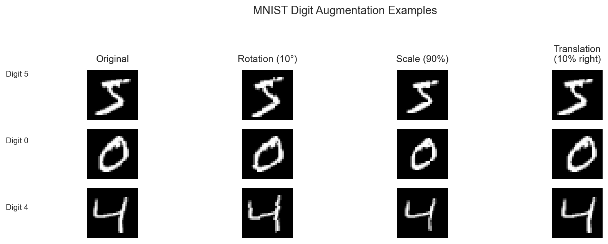

# MLOps Pipeline MNIST

[](https://github.com/weavermonkey/mlops-pipeline-mnist/actions/workflows/test.yml)


### Model Metrics


A lightweight CNN model for MNIST digit classification with MLOps practices.

## Model Architecture

```
Input: 28×28×1 grayscale images
```

| Layer | Type | Input Shape | Kernel | Output Shape | Activation | Pooling |
|-------|------|-------------|--------|--------------|------------|---------|
| **Conv1** | Conv2d | 28×28×1 | 3×3, 12 filters, padding=1 | 28×28×12 | LeakyReLU(0.1) | MaxPool2d(2) |
| | | | | **→ 14×14×12** | | |
| **Conv2** | Conv2d | 14×14×12 | 3×3, 16 filters, padding=1 | 14×14×16 | LeakyReLU(0.1) | MaxPool2d(2) |
| | | | | **→ 7×7×16** | | |
| **Conv3** | Conv2d | 7×7×16 | 3×3, 20 filters, padding=1 | 7×7×20 | LeakyReLU(0.1) | MaxPool2d(2) |
| | | | | **→ 3×3×20** | | |
| **FC1** | Linear | 180 (flattened) | - | 32 | LeakyReLU(0.1) | - |
| **FC2** | Linear | 32 | - | 10 | None (logits) | - |

### Architecture Flow
```
28×28×1 → [Conv1+BN+ReLU+Pool] → 14×14×12 → [Conv2+BN+ReLU+Pool] → 7×7×16 → [Conv3+BN+ReLU+Pool] → 3×3×20 → [Dropout] → [FC1+ReLU] → 32 → [FC2] → 10
```

## Training Logs

### Training Configuration
```
[2025-09-14 09:20:00 IST] Starting MNIST Training
[2025-09-14 09:20:00 IST] Model initialized with 10,982 parameters
[2025-09-14 09:20:00 IST] Training configuration:
  - Device: cpu
  - Optimizer: Adam (lr=0.003)
  - Loss: CrossEntropyLoss
  - Batch size: 32
  - Total batches per epoch: 1875
```

### Epoch 1 Progress
```
[2025-09-14 09:20:00 IST] Starting Epoch 1
[2025-09-14 09:20:02 IST] Epoch 1, Batch 100/1875,  Loss: 0.7608, Accuracy: 78.75%
[2025-09-14 09:20:03 IST] Epoch 1, Batch 200/1875,  Loss: 0.4749, Accuracy: 86.42%
[2025-09-14 09:20:04 IST] Epoch 1, Batch 300/1875,  Loss: 0.3678, Accuracy: 89.39%
[2025-09-14 09:20:04 IST] Epoch 1, Batch 400/1875,  Loss: 0.3132, Accuracy: 90.94%
[2025-09-14 09:20:05 IST] Epoch 1, Batch 500/1875,  Loss: 0.2747, Accuracy: 92.02%
[2025-09-14 09:20:06 IST] Epoch 1, Batch 600/1875,  Loss: 0.2443, Accuracy: 92.84%
[2025-09-14 09:20:06 IST] Epoch 1, Batch 700/1875,  Loss: 0.2228, Accuracy: 93.42%
[2025-09-14 09:20:07 IST] Epoch 1, Batch 800/1875,  Loss: 0.2071, Accuracy: 93.86%
[2025-09-14 09:20:08 IST] Epoch 1, Batch 900/1875,  Loss: 0.1939, Accuracy: 94.21%
[2025-09-14 09:20:08 IST] Epoch 1, Batch 1000/1875, Loss: 0.1839, Accuracy: 94.46%
[2025-09-14 09:20:09 IST] Epoch 1, Batch 1100/1875, Loss: 0.1757, Accuracy: 94.71%
[2025-09-14 09:20:10 IST] Epoch 1, Batch 1200/1875, Loss: 0.1692, Accuracy: 94.90%
[2025-09-14 09:20:10 IST] Epoch 1, Batch 1300/1875, Loss: 0.1623, Accuracy: 95.09%
[2025-09-14 09:20:11 IST] Epoch 1, Batch 1400/1875, Loss: 0.1569, Accuracy: 95.25%
[2025-09-14 09:20:12 IST] Epoch 1, Batch 1500/1875, Loss: 0.1514, Accuracy: 95.41%
[2025-09-14 09:20:12 IST] Epoch 1, Batch 1600/1875, Loss: 0.1468, Accuracy: 95.54%
[2025-09-14 09:20:13 IST] Epoch 1, Batch 1700/1875, Loss: 0.1425, Accuracy: 95.65%
[2025-09-14 09:20:14 IST] Epoch 1, Batch 1800/1875, Loss: 0.1380, Accuracy: 95.76%
```

### Final Results
```
[2025-09-14 09:20:15 IST] Epoch 1 completed - Final Loss: 0.1367, Final Accuracy: 95.81%
[2025-09-14 09:20:15 IST] Training completed!
[2025-09-14 09:20:15 IST] Final first epoch accuracy: 95.81%
```

### Training Summary
- **Training Time**: ~15 seconds (single epoch)
- **Convergence**: Achieved 95.81% accuracy in first epoch
- **Loss Reduction**: 0.7608 → 0.1367 (82% reduction)
- **Accuracy Progression**: 78.75% → 95.81% (17% improvement)

## Model Specifications

- **Total Parameters**: 10,982
- **First Epoch Accuracy**: >95% (without data augmentation)
- **Batch Size**: 32
- **Learning Rate**: 0.003
- **Optimizer**: Adam
- **Loss Function**: CrossEntropyLoss

## Regularization

- Batch Normalization after each conv layer
- Dropout(0.1) before FC1
- **Data augmentation is optional** (disabled by default):
  - Rotation: ±5 degrees
  - Translation: ±5% in any direction
  - Scaling: 95-105% of original size
  - Applied with 20% probability when enabled

## Data Augmentation
The model includes data augmentation to improve robustness. Each image has a 20% chance of being augmented using one of these transformations:

| Transformation | Parameters |
|---------------|------------|
| Rotation | ±5 degrees |
| Translation | ±5% in any direction |
| Scaling | 95-105% of original size |

### Augmentation Examples
Below are examples of different augmentation techniques applied to MNIST digits:



Each row shows an original digit followed by three augmentation techniques:
- **Rotation**: Applied 10° rotation
- **Scale**: Reduced to 90% of original size
- **Translation**: Shifted 10% to the right

## Training

```python
python model.py
```

## Testing

```python
pytest test_model.py
```

Tests include:
- Parameter count validation
- First epoch accuracy check
- Gradient flow verification
- Noise robustness testing
- Augmentation validation

## GitHub Actions
The pipeline automatically tests:
1. Model parameter count (must be < 25,000)
2. First epoch accuracy (must be > 95%)
3. Gradient flow through all layers
4. Model robustness to noise
5. Augmentation effectiveness
